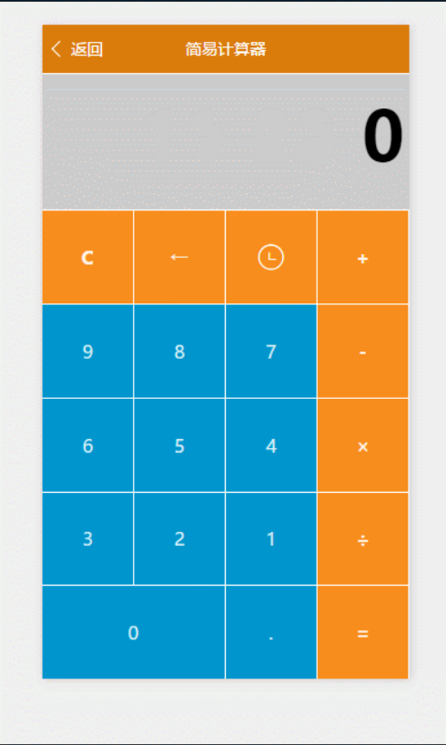
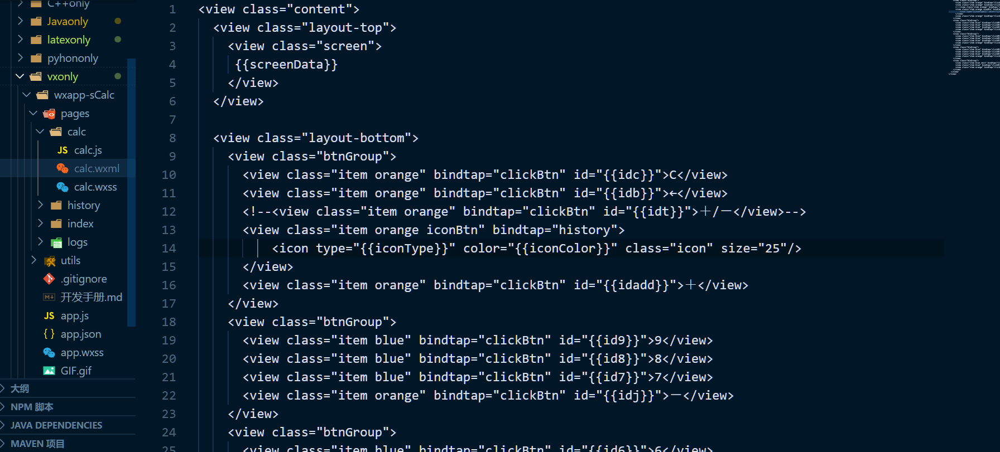
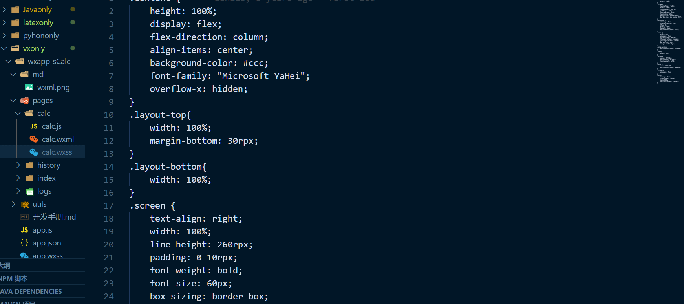
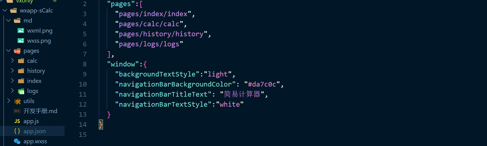
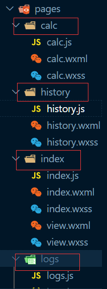
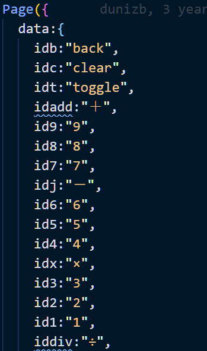
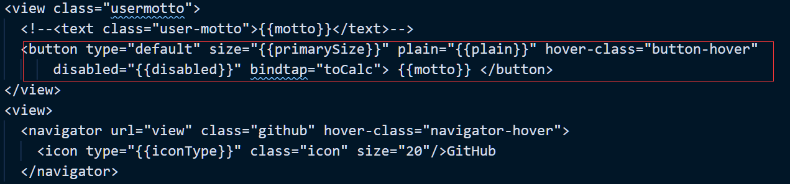
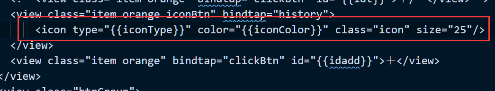
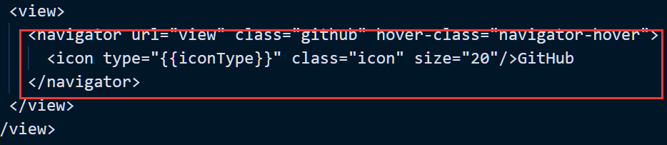
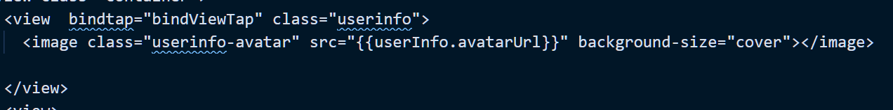

# 微信小程序：计算器


## xxx.wxml文件和xxx.wxss文件
wxml是微信自己开发的一套标记语言，可以直接看做是HTML文件也没问题，因为界面构建都是在这个文件里编写，只是没有HTML标签了，只有wxml标签了，而wxml标签数量也是很少的。

wxss是微信自己开发的一套样式文件格式，等同于CSS文件，写法也是一样的，只是换了个文件后缀，CSS是怎么写的在微信小程序中我们依然怎么写。


## xxx.js和xxx.json文件
xxx.js文件就是写JS的地方，每个xxx.js对应一个同名的xxx.wxml文件，xxx.js文件必须有Page对象，哪怕该页面没有任何业务逻辑。输入Page微信Web开发者工具会自动生成一些列空方法待去实现，当然是可以不实现，只是把你把骨架搭好而已。<br>
xxx.josn文件就是配置文件，一般是全局配置才用，比如根目录的```app.josn```，定义了小程序由哪些页面构成，小程序导航Bar样式等，属性看名字就知道什么意思了。


```pages```属性配置的是页面，第一个就是启动页，所有页面都必须在这里配置，如果建立了一个页面忘记在这里添加了，那么就会很郁闷的，应为到时候页面跳转的时候```onLoad```方法不会执行，我就被这个浪费好多时间。

## 整体结构
看看下面的项目结构图，一个页面是一个文件夹，一个面通常都有js、wxml、wxss，wxml和js文件是必须的，可以有没有样式

calc（计算器页面）、history（历史记录）、index（小程序首页、启动页）、logs（日志信息）、utils（js工具类）,logs和utils是自带的，可以有可以没有。

## 源码分析
这个简易计算器界面布局，采用CSS Flexbox布局.

计算器的按键，都是用```<text>```标签来做的，加上wxss样式即可，当然也可以直接用button组件。

wxml:

    <view class="btnGroup">
        <view class="item blue" bindtap="clickBtn" id="{{id9}}">9</view>
        <view class="item blue" bindtap="clickBtn" id="{{id8}}">8</view>
        <view class="item blue" bindtap="clickBtn" id="{{id7}}">7</view>
        <view class="item orange" bindtap="clickBtn" id="{{idj}}">－</view>
    </view>

这里```bindtap```，是用来绑定事件的，在HTML中使用onclick一个道理。```id={{id9}}``` 双大括号中的值来自js文件中```data```属性定义的同名属性


wxss:

    .btnGroup {
        display: flex;
        flex-direction: row;
        flex: 1;
        width: 100%;
        background-color: #fff;
    }
    .item {
        width:25%;
        display: flex;
        align-items: center;
        flex-direction: column;
        justify-content: center;
        margin-top: 1px;
        margin-right: 1px;
    }
    .item:active {
        background-color: #ff0000;
    }

## 主要涉及组件

- 主要使用view text标签
- 按钮（button），index页面的按钮“简易计算器”
  
- 图标（icon）
  
- 标记方式调整页面（navigator）
  
- 图片(image) 首页头像
  
- for循环，历史记录显示页面用到了，得从Storage中读取数据展示，而Storage中保存就是一个数组
```
<block wx:for="{{logs}}" wx:for-item="log">
<view class="item">{{log}}</view>
</block>
```

## 主要设计API
- wx.navigateTo，导航，跳转，在当前页面打开新页面
- Storage，本地存储，保存计算历史记录用到了它有setStorage、getStorage，同时还有带Sync结尾的异步方法
W
W
## 注意事项
1. 每新建一个页面一定要记得去```app.josn```的```pages```属性中添加，不然的话使用```navigateTo```跳转到新页面后新页面的```onLoad```方法不会执行。

2. 微信小程序中没有window等JavaScript对象，所以在写JS前想好替代方案。

3. 微信小程序中的JS并不是真正的JS，wxss也并不是真正的CSS，所以写的时候还是要注意一下。

4. 本计算器存在不完善和bug，因为重点不是实现全部功能，而是搞清楚微信小程序开发方法，所以非关注点不用在意。

